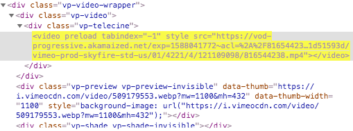

#Download blob video without any tool

Note that this method can only download Vimeo blob video.

Step 1. Open a Vimeo blob video in a web browser. I’m using Chrome.

Step 2. Right-click and select the Inspect option that appears. Find the blob URL.

Step 3. Replace the blob URL with x.

Step 4. Right-click the element and select Edit as HTML. Replace x with y.

Step 5. Exit the edit box, and a new URL will be generated, as shown in the screenshot.

the generated URL
Note: If it fails to generate such an URL, you can repeat the three steps above.

Step 6. Now open the said URL in your browser.

Step 7. Click the three dots icon in the bottom right corner of the player screen and select Download. It will start downloading blob MP4.

