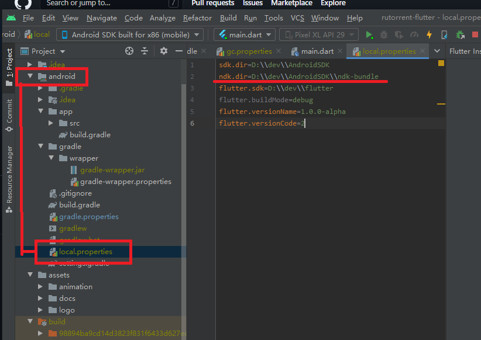

Method 1: set your ```NDK``` path ```(ex. ndk.dir=F\:\\WorkSoft\\NDK\\android-ndk-r17b)``` in your local.properties in android studio

or

Method 2: ```Android Studio->File->Project Structure->SDK Location``` and bottom side set your NDK path


[tool] No toolchains found in the NDK toolchains folder for ABI with prefix: arm-linux-androideabi


```

FAILURE: Build failed with an exception.

*   What went wrong:
    Execution failed for task ':app:stripDebugDebugSymbols'.

> No toolchains found in the NDK toolchains folder for ABI with prefix: arm-linux-androideabi

*   Try:
    Run with --stacktrace option to get the stack trace. Run with --info or --debug option to get more log output. Run with --scan to get full insights.

*   Get more help at [https://help.gradle.org](https://help.gradle.org)


```


sources:[No toolchains found in the NDK toolchains folder for ABI with prefix: arm-linux-androideabi](https://github.com/flutter/flutter/issues/76393)
[How to set default NDK's path in Android Studio?](https://stackoverflow.com/questions/51699984/how-to-set-default-ndks-path-in-android-studio)
()
