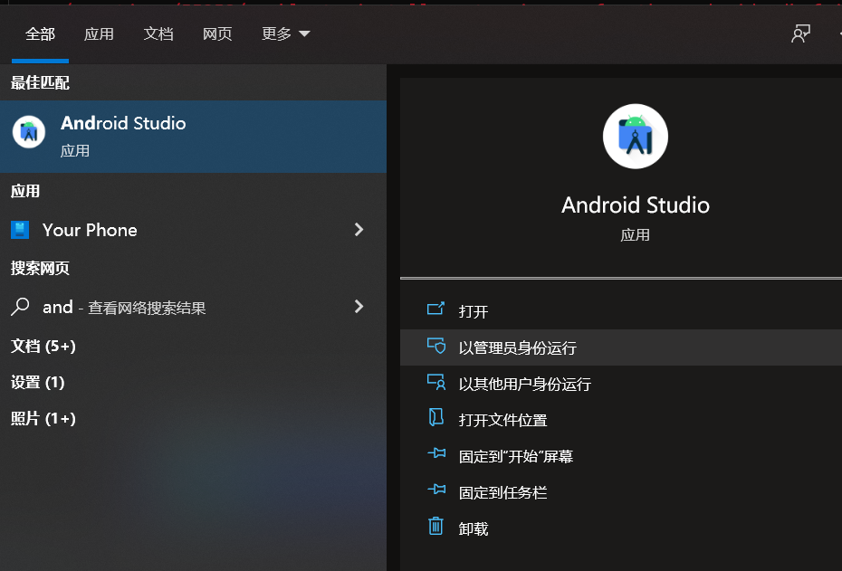

The SDK needs to be run as admistrator to be able to write those files.

Just retry and run it with elevated rights.

source:[Unable to install system images for the Android SDK: “Failed to create directory”](https://android.stackexchange.com/questions/55258/unable-to-install-system-images-for-the-android-sdk-failed-to-create-directory)
[Android Emulator Setup](https://docs.microsoft.com/zh-cn/xamarin/android/get-started/installation/android-emulator/)
